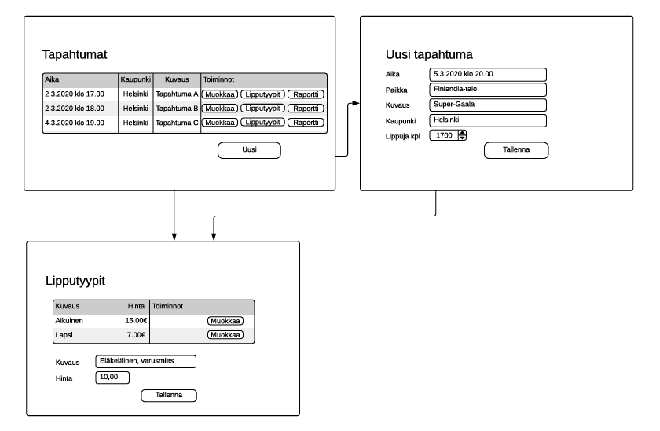
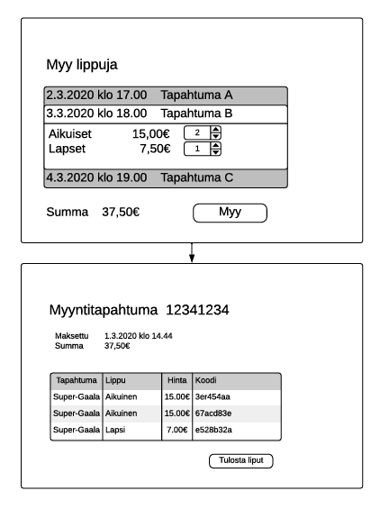
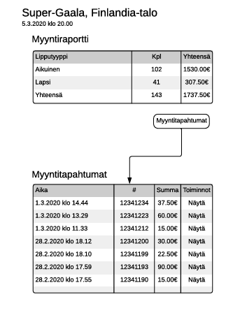
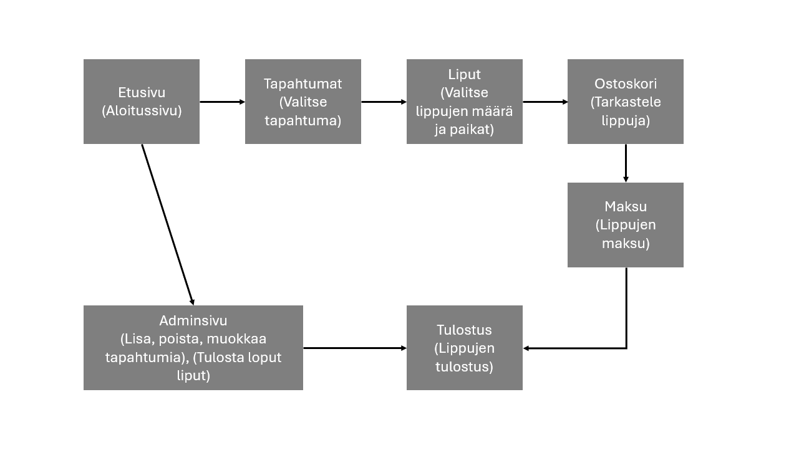
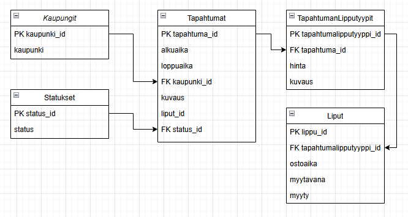

Tiikerit
Tiimi: Teppo Halme, Anton Mattila, Markus Ovaska, Heli Saarinen, Ossi Saurio

# Johdanto

Lipputoimisto on tilannut lipunmyyntijärjestelmän lippujen myymiseen myyntipisteessään. Toimisto voi määritellä järjestelmään tapahtumat, joihin lippuja myydään. Järjestelmän alustava nimi on TicketGuru.
Lipunmyyntipisteessä lipunmyyjä myy ja tulostaa asiakkaalle liput. Ennakkomyynnin loputtua loput liput tulostetaan ovella myytäviksi. Lipuissa on ovella helposti tarkastettava koodi, jolla lippu voidaan ovella merkitä käytetyksi.
Jatkokehityksessä järjestelmään aiotaan lisätä verkkokauppa, jolla asiakkaat voivat itse ostaa lippuja.
Mitä tekniikoita käytetään? 
Mitä on konkreettisesti valmiina, kun projekti päättyy?

# Järjestelmän määrittely

Toimisto voi lisätä tapahtumat, joihin myydään lippuja
Lipunmyyjä myy lipun
Lipunmyyjä tulostaa lipun
Myymättä jääneet liput tulostetaan
Lipuissa on koodi, jolla lippu voidaan ovella merkitä käytetyksi
Verkkokauppa, jossa asiakkaat voivat ostaa lippuja

# Lipunmyyjä (Alustavat käyttäjätarinat)

Roolissani lipunmyyjä, haluan valita asiakkaan haluaman tapahtuman järjestelmän tarjoamasta valikoimasta, niin että voin myydä lippuja useampaan eri tapahtumaan.

Roolissani lipunmyyjä, haluan määritellä kuinka monta aikuista ja lasta haluaa ostaa lipun, niin että myyntitapahtuma voidaan tarvittaessa tehdä ryhmissä.

Roolissani lipunmyyjä, haluan nähdä transaktion tiedot tapahtuman jälkeen, niin että voin todeta tiedot oikeaksi niin itselleni kuin asiakkaalle.

Roolissani lipunmyyjä, haluan tulostaa asiakkaalle liput transaktion mennessä läpi, niin että asiakas saa fyysisen todisteen ostoksestaan.

# Toimisto (Alustavat käyttäjätarinat)

Roolissani toimisto, haluan nähdä katalogin kaikista aktiivisista tapahtumista, niin että tiedän mihin kaikkeen lippuja tällä hetkellä myydään.

Roolissani toimisto, haluan luoda ja poistaa tapahtumia, niin että voin ylläpitää katalogia ajan tasalla.

Roolissani toimisto, haluan luodessani tapahtumaa määrittää ajan, paikan, kuvauksen, kohdekaupungin ja lippumäärän, niin että pystyn tarkasti määrittelemään jokaisen uuden tapahtuman.

Roolissani toimisto, pystyn määritellä ja muokkaa lipputyyppejä, ja lisätä uusia esim. "varusmies" -tyyppejä. Näin pystyn tarvittaessa houkuttelemaan tiettyjä kohderyhmiä mukaan tapahtumiin.

Roolissani toimisto, pystyn vetämään tulostettavia raportteja jokaisesta aktiivisesta ja päättyneestä tapahtumasta, niin että pystyn suorittamaan data-analytiikkaa ja kehittämään liiketoimintaa tapahtumien menestyksen perusteella.

Roolissani toimisto, pystyn näkemään kaikki myyntitapahtumat helposti aktiivisten ja päättyneiden tapahtumien raportti sivulta, niin että pystyn tarvittaessa todentamaan uniikkeja transaktioita esim. asiakaspalvelutilanteissa.

Roolissani toimisto, haluan nähdä tapahtumahistorian jossa näkyy kaikki päättyneet tapahtumat, niin että pystyn palata ajassa taaksepäin vetämään esim. raportteja ja näkemään muita tietoja.

# Asiakas (Alustavat käyttäjätarinat)

Roolissani asiakas, haluan tarkastella tulevia tapahtumia itsenäisesti internetistä sekä nähdä tapahtumien lipputyypit ja hinnat.

Roolissani asiakas, haluan ongelmatilanteissa helpon väylän saada yhteyden lipputoimiston asiakaspalveluun.

Roolissani asiakas, haluan tarkastella omia varauksiani sekä hallinnoida näitä.

Roolissani asiakas, haluan hakea tapahtumia eri hakusuodattimilla, jotta löydän oikean alueen sekä ajan tapahtumat omien kriteerieni mukaisesti.

Roolissani asiakas, tahdon ladata lippuni sähköisesti laitteelleni kätevästi nettisivulta.

Roolissani asiakas, tahdon saada sähköpostivahvistuksen maksutapahtumistani.

# Tapahtumanjärjestäjä (Alustavat käyttäjätarinat)

Roolissani tapahtumanjärjestäjä, tahdon reaaliaikaisesti seurata tapahtumani lipunmyyntiä.

Roolissani tapahtumanjärjestäjä, tahdon kasvattaa tai laskea lippukapasiteettia lipunmyyntipalvelussa mahdollisten muutoksien myötä tapahtumaa järjestäessä.

Roolissani tapahtumanjärjestäjä, tahdon lisätä eri lipputyyppejä sekä hinnoittelumalleja (mm. early bird- sekä VIP-liput)

- Toimisto voi lisätä tapahtumat, joihin myydään lippuja
- Lipunmyyjä myy lipun
- Lipunmyyjä tulostaa lipun
- Myymättä jääneet liput tulostetaan
- Lipuissa on koodi, jolla lippu voidaan ovella merkitä käytetyksi
- Verkkokauppa, jossa asiakkaat voivat ostaa lippuja

# Käyttöliittymä
(Esitetään käyttöliittymän tärkeimmät (vain ne!) näkymät sekä niiden väliset siirtymät käyttöliittymäkaaviona.

Jos näkymän tarkoitus ei ole itsestään selvä, se pitää kuvata lyhyesti.)

Tapahtumat:
- tapahtumat listattuna: aika, kaupunki, kuvaus sekä toiminnot: muokkaa, lipputyypit ja raportti
- lisää uusi tapahtu Uusi-painikkeella.

Uusi tapahtuma:
- aika, paikka, kuvaus, kaupunki, lippuja kpl (määrä)
- tallenna

Lipputyypit:
- Kuvaus, hinta sekä toiminto: muokkaa
- uuden lipputyypin voi lisätä, antaa sille hinnan ja tallentaa

Myy lippuja:
- ajankohta, tapahtuman kuvaus
- myynnissä olevat lipputyypit ja niihin valittavissa haluttu kappalemäärä
- summa €
- myy-painike

Myyntitapahtuma:
- yksittäisen tapahtuman tiedot
- myydyt liput
- tulosta liput

Myyntiraportti (yksittäisestä tapahtumasta):
- lipputyyppi, kpl, yhteensä (€)
- myyntitapahtumat-painike

Myyntitapahtumat: 
- aika, tapahtuman id, summa (€) ja toiminnot: näytä 

Yleiskuva käyttöliittymästä:

# Tietokanta

Tietokantaan säilytään laajasti tietoja, niin tapahtumista kuin tapahtumien asiakkaista. Yllä olevassa käsitemallissa on mallinnettu käsiteltävät tiedot.

**Tietohakemisto kirjallisena:**

**1. Kaupungit**
Kaupunki-taulu sisältää paikkakunnat jossa tapahtumia voi sijaita.
- kaupunki_id (PK): Kaupungin tunniste, ensisijainen avain
- kaupunki: Kaupungin nimi

**2. Tapahtumat**
Tapahtumat-taulu sisältää tapahtumat ja niille kriittiset tiedot.
- tapahtuma_id (PK): Tapahtuman tunniste, ensisijainen avain
- alkuaika: Tapahtuman alkuaika
- loppuaika: Tapahtuman loppuaika
- FK kaupunki_id: Viiteavain kaupunki-tauluun
- kuvaus: Tapahtuman kuvaus
- liput_id: Viite lippuihin
- FK status_id: Viiteavain statukset-tauluun

**3. Statukset**
Statukset-taulu sisältää tapahtuman aktiivisen statuksen (Ostettavana, lipunmyynti päättynyt, loppuunmyyty)
- status_id (PK): Statuksen tunniste, ensisijainen avain
- status: Statuksen kuvaus

**4. TapahtumanLipputyypit**
TapahtumanLipputyypit-taulu sisältää tapahtuman kaikki mahdolliset lipputyypit hintoineen ja kuvauksineen
- tapahtumalipputyyppi_id (PK): Lipputyypin tunniste, ensisijainen avain
- FK tapahtuma_id: Viiteavain tapahtumat-tauluun
- hinta: Lipun hinta
- kuvaus: Lipputyypin kuvaus

**5. Liput**
Liput-taulu sisältää lipun tiedot.
- lippu_id (PK): Lipun tunniste, ensisijainen avain
- FK tapahtumalipputyyppi_id: Viiteavain taphtumanlipputyypit-tauluun
- ostoaika: Aika, jolloin lippu on ostettu
- myytavana: Ilmaisee, onko lippu myytävänä
- myyty: Ilmaisee, montako lippua on myyty.

**Viiteavaimet (Foreign Keys):**
- Taphtumat.kaupunki_id viittaa tauluun Kaupungit.kaupunki_id
- Taphtumat.status_id viittaa tauluun Statukset.status_id
- TaphtumanLipputyypit.tapahtuma_id viittaa tauluun Taphtumat.tapahtuma_id
- Liput.tapahtumalipputyyppi_id viittaa tauluun TaphtumanLipputyypit.tapahtumalipputyyppi_id

# Tekninen kuvaus
Teknisessä kuvauksessa esitetään järjestelmän toteutuksen suunnittelussa tehdyt tekniset ratkaisut, esim.

Missä mikäkin järjestelmän komponentti ajetaan (tietokone, palvelinohjelma) ja komponenttien väliset yhteydet (vaikkapa tähän tyyliin: https://security.ufl.edu/it-workers/risk-assessment/creating-an-information-systemdata-flow-diagram/)
Palvelintoteutuksen yleiskuvaus: teknologiat, deployment-ratkaisut yms.
Keskeisten rajapintojen kuvaukset, esimerkit REST-rajapinta. Tarvittaessa voidaan rajapinnan käyttöä täsmentää UML-sekvenssikaavioilla.
Toteutuksen yleisiä ratkaisuja, esim. turvallisuus.
Tämän lisäksi

ohjelmakoodin tulee olla kommentoitua
luokkien, metodien ja muuttujien tulee olla kuvaavasti nimettyjä ja noudattaa johdonmukaisia nimeämiskäytäntöjä
ohjelmiston pitää olla organisoitu komponentteihin niin, että turhalta toistolta vältytään

# Testaus
Tässä kohdin selvitetään, miten ohjelmiston oikea toiminta varmistetaan testaamalla projektin aikana: millaisia testauksia tehdään ja missä vaiheessa. Testauksen tarkemmat sisällöt ja testisuoritusten tulosten raportit kirjataan erillisiin dokumentteihin.

Tänne kirjataan myös lopuksi järjestelmän tunnetut ongelmat, joita ei ole korjattu.

# Asennustiedot
Järjestelmän asennus on syytä dokumentoida kahdesta näkökulmasta:

järjestelmän kehitysympäristö: miten järjestelmän kehitysympäristön saisi rakennettua johonkin toiseen koneeseen

järjestelmän asentaminen tuotantoympäristöön: miten järjestelmän saisi asennettua johonkin uuteen ympäristöön.

Asennusohjeesta tulisi ainakin käydä ilmi, miten käytettävä tietokanta ja käyttäjät tulee ohjelmistoa asentaessa määritellä (käytettävä tietokanta, käyttäjätunnus, salasana, tietokannan luonti yms.).

# Käynnistys- ja käyttöohje
Tyypillisesti tässä riittää kertoa ohjelman käynnistykseen tarvittava URL sekä mahdolliset kirjautumiseen tarvittavat tunnukset. Jos järjestelmän käynnistämiseen tai käyttöön liittyy joitain muita toimenpiteitä tai toimintajärjestykseen liittyviä asioita, nekin kerrotaan tässä yhteydessä.

Usko tai älä, tulet tarvitsemaan tätä itsekin, kun tauon jälkeen palaat järjestelmän pariin !
